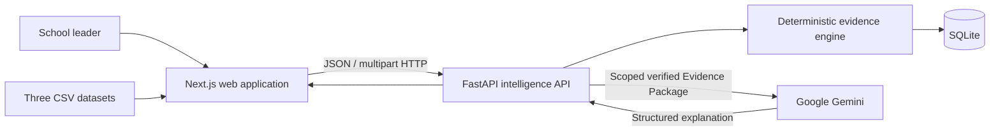
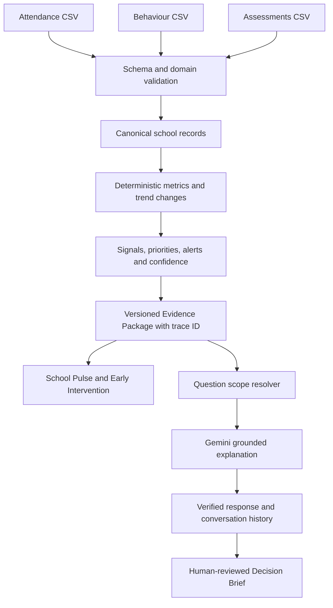

# Veriq MVP As-Built Architecture

**Status:** Implemented Development-track MVP  
**Last verified:** 14 July 2026

This document describes the code in this repository. It supersedes future-state documents that mention Supabase, LangGraph, OpenAI or other services not used by the current MVP.

## System context

The browser never sends uploaded CSV data directly to Gemini. It sends the files to FastAPI, which validates and normalises the records, calculates evidence and persists the current snapshot. Gemini receives only the scoped evidence needed to answer the leader's question.

## Implemented components

| Component | Location | Responsibility |
|---|---|---|
| School Pulse | `app/page.tsx` | Whole-school metrics, priorities, alerts and Beacon entry points. |
| Early Intervention | `app/early-intervention/` | Class and learner monitoring with evidence-connected actions. |
| Beacon | `app/beacon/` | Scoped conversation, evidence explanation and history. |
| Decision Brief | `app/decision-brief/` | Human review of recommendation, evidence, actions, owner and status. |
| Upload | `app/upload/` | Three-file CSV selection and import result handling. |
| Typed API client | `lib/veriq-api.ts` | Frontend types, request timeout, caching and structured error handling. |
| HTTP API | `backend/app/main.py` | Validation boundary, API contracts, CORS and error responses. |
| Import service | `backend/app/services/imports.py` | CSV schema validation, normalisation and import orchestration. |
| Evidence analysis | `backend/app/services/analysis.py` | Aggregations, signals, priorities, intervention and confidence. |
| Evidence scoping / Beacon | `backend/app/services/beacon.py` | Scope resolution, Gemini prompting, grounding and safe fallbacks. |
| Decision service | `backend/app/services/decisions.py` | Converts a reviewed explanation into a Decision Brief. |
| Persistence | `backend/app/services/database.py` | SQLite schema and repositories. |

## Evidence flow

An import is accepted only when all three CSV files pass validation. The Evidence Package contains the active analysis ID, trace ID, school and period, school metrics, class and learner summaries, subject summaries, priorities, alerts, supporting evidence, missing evidence and confidence.

## Deterministic and AI responsibilities

### Deterministic application logic

- CSV required-column, type and domain validation.
- Record storage and association by learner, class, date and subject.
- Attendance percentages, behaviour incident counts and assessment averages.
- Previous/current period comparison and signal severity.
- School, class, learner, metric and intervention scoping.
- Confidence and missing-evidence presentation.
- Persistence, trace IDs, conversation history and decision status.

### Gemini responsibilities

- Understand a school leader's natural-language question.
- Explain why several verified indicators may matter together.
- Tailor language to the selected school, class, learner or metric scope.
- Propose a proportionate action from the supplied evidence.
- Produce a structured draft for human review.

Gemini is not the source of school metrics. Prompted or generated numbers that are not present in the Evidence Package are not exposed as verified facts.

## Persistence model

The local MVP uses SQLite with these implemented tables:

- `imports`: accepted import metadata and hashes.
- `school_records`: normalised attendance, behaviour and assessment rows.
- `evidence_snapshots`: the current and historical Evidence Packages.
- `workspace_settings`: active school and user display context.
- `beacon_conversations` and `beacon_turns`: analysis-scoped conversation history.
- `decisions`: generated Decision Briefs and human-owned updates.

The default database is generated beneath `backend/data/` and is deliberately excluded from Git because it is runtime state.

## Trust and traceability controls

- Every evidence response includes an `analysis_id` and `trace_id`.
- Beacon rejects a stale client analysis ID instead of answering against changed data.
- A named known learner overrides a broad page scope; an unknown learner triggers clarification.
- Evidence is scoped before it is passed to Gemini.
- Missing evidence is shown to the user rather than silently treated as complete.
- Decision Brief ownership and status remain editable human fields.
- Provider failures return safe 502/503 responses without leaking the API key.

## Runtime topology

For the local demonstration:

- Next.js listens on port 3000.
- FastAPI/Uvicorn listens on port 8000.
- The frontend uses `NEXT_PUBLIC_VERIQ_API_URL` to reach FastAPI.
- FastAPI reads `GEMINI_API_KEY`, `GEMINI_MODEL` and optional `VERIQ_DB_PATH` from `backend/.env`.
- FastAPI CORS permits `localhost:3000` and `127.0.0.1:3000`.

The CCE packaging task will containerise these processes, make allowed origins configurable and mount SQLite storage explicitly for the adjudication environment.

## Known production gaps

The MVP does not yet implement login, role-based authorisation, multi-school tenant isolation, encryption-at-rest key management, production backups, deletion workflows or a managed database. These are stated limitations and planned pilot controls, not capabilities claimed by the current build.
